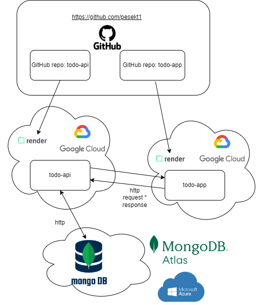

# TODO API with TypeScript and node.js

working with TypeScript:

new project:


```bash
npm init -y
npm install -D ts-node
```

now in package.json:

```json
"scripts": {
    "start": "ts-node src/index.ts"
}
```

now we can run:
```
npm start
```

Express:

```
npm i express
npm i -D typescript @types/node @types/express
```

create typescript compiler configuration file: tsconfig.json

```
tsc --init
```

## System architecture with deployment


